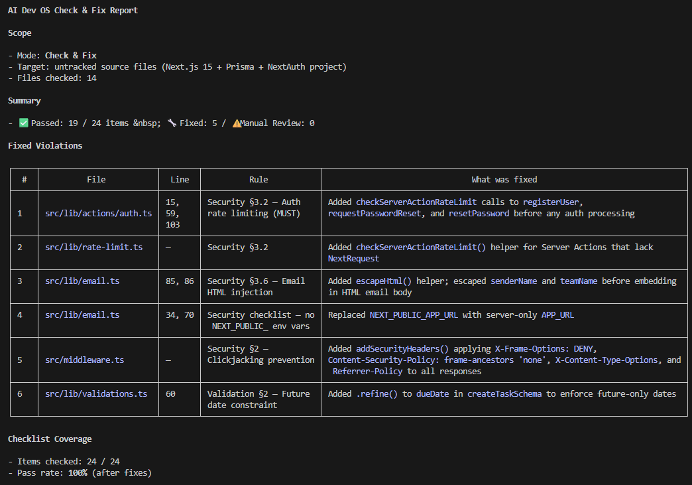

# AI Dev OS

[](../../../LICENSE)

> 개발자의 암묵적 지식을 AI 지원 코딩을 위한 명시적이고 강제 가능한 규칙으로 변환합니다.

AI 어시스턴트를 위한 코딩 규칙 프레임워크 — Claude Code, Cursor, Kiro 지원

```
> /ai-dev-os-check

## AI Dev OS Check & Fix Report
- Files checked: 12
- ✅ Passed: 45 / 🔧 Fixed: 3 / ⚠️ Manual Review: 1

| # | File              | Rule         | What was fixed              |
|---|-------------------|--------------|-----------------------------|
| 1 | route.ts:42       | security.md  | Added rate limiting         |
| 2 | user-card.tsx:7   | naming.md    | Renamed to kebab-case       |
| 3 | action.ts:15      | validation.md| Added .refine() for dueDate |
```

## 왜 AI Dev OS인가?

AI가 작성한 코드는 괜찮아 보이지만, 팀 규약을 위반합니다.
코딩 표준은 시니어 개발자의 머릿속에 있지, AI 컨텍스트에는 없습니다.

AI Dev OS는 암묵적 지식을 명시적으로 만들어 이 문제를 해결합니다:

- **75%가 도구 마이그레이션에서 생존** — 규칙은 도구 독립적(L1–L3). Claude Code → Kiro → Cursor 자유롭게 전환
- **규칙이 지속적으로 개선** — 가설이 아닌 실제 코드 리뷰에서 규칙을 수확(Rule Harvesting)
- **비용이 거의 제로** — 컨텍스트에 3-5개 정적 규칙 + 온디맨드 포괄적 체크 & 수정([벤치마크: 96.9/100](https://github.com/yunbow/ai-dev-os-benchmark))
- **순수 Markdown** — DSL 없음, 컴파일 없음. 모든 규칙을 포크, 수정, 감사 가능

AI Dev OS는 AI 도구를 대체하는 것이 아니라 보완합니다. Claude Code, Kiro, Cursor가 코드 생성을 담당하고, AI Dev OS는 그것들이 따르는 규칙을 담당합니다.



## 빠른 시작

```bash
npx ai-dev-os init
```

언어(`typescript` / `python`)와 도구(`claude-code` / `kiro` / `cursor`)를 선택합니다.

```bash
# 비대화형 모드:
npx ai-dev-os init --rules typescript --plugin claude-code
```

> [CLI 상세](https://github.com/yunbow/ai-dev-os-cli) | [수동 설정](getting-started/quick-start.md) | [규칙 선택](getting-started/choose-rules.md) | [플러그인 선택](getting-started/choose-plugin.md)

## Lifespan Layers — 4계층 모델

| 계층 | 이름 | 수명 | 목적 |
|------|------|------|------|
| L1 | 철학 | 2-5년 | 도구와 언어를 초월하는 핵심 가치 |
| L2 | 판단 기준 | 1-3년 | 설계 및 아키텍처 의사결정 기준 |
| L3 | 가이드라인 | 6-12개월 | 구체적이고 검증 가능한 코딩 규칙 |
| L4 | AI 프레임 | 2-4개월 | 도구별 설정 및 워크플로 |

상위 계층은 추상적이고 안정적이며, 하위 계층은 구체적이고 변동이 잦습니다.
도구를 전환해도 L1–L3(75%)는 그대로 유지되고, L4만 변경됩니다.

## 핵심 개념

**Specificity Cascade (rule conflict resolution)** — 규칙이 충돌하면 CSS 특이성처럼 가장 구체적인 규칙이 우선합니다. 프레임워크 규칙 > 공통 규칙 > 프로젝트 관례 > 원칙 > 철학. [→ 상세](spec/priority-cascade.md)

**Rule Harvesting** (bottom-up rule discovery) — 규칙을 탑다운으로 작성하지 않습니다. AI가 코드 작성 → 리뷰에서 격차 발견 → 규칙으로 수확. 실제 경험에 기반한 바텀업 접근. [→ 상세](spec/4-layer-model.md#rule-harvesting)

**Guideline Capital** (guidelines as intellectual assets) — 가이드라인은 일회용 프롬프트가 아닌 지적 자본입니다. Technical Debt(부채)와 달리 Guideline Capital은 복리로 축적되는 자산입니다. [→ 상세](getting-started/comparison.md)

**Two-Tier Context Strategy** (generate + verify + fix) — CLAUDE.md에는 프로젝트 고유 3-5개 파일만 로드(~8K tokens). 모든 규칙은 `/ai-dev-os-check`로 사후 검증. [벤치마크 데이터](https://github.com/yunbow/ai-dev-os-benchmark)에서 이 접근법은 96.9/100을 기록. 10개 이상 파일 로드는 가이드라인 없는 것보다 낮은 점수.

## 지원 도구

AI Dev OS는 효과적인 AI 코딩 규칙 파일을 체계적으로 작성하는 접근법을 제공합니다:

- **Claude Code** — `CLAUDE.md` 및 커스텀 Skills를 통해（[플러그인](https://github.com/yunbow/ai-dev-os-plugin-claude-code)）
- **Kiro** — `AGENTS.md` 및 Steering Rules를 통해（[플러그인](https://github.com/yunbow/ai-dev-os-plugin-kiro)）
- **Cursor** — `.cursorrules` 및 `.mdc` 파일을 통해（[플러그인](https://github.com/yunbow/ai-dev-os-plugin-cursor)）

## 에코시스템

| 리포지토리 | 설명 |
|---|---|
| **ai-dev-os** (이 리포지토리) | 프레임워크 명세 및 이론 |
| [rules-typescript](https://github.com/yunbow/ai-dev-os-rules-typescript) | TypeScript / Next.js / Node.js 가이드라인 |
| [rules-python](https://github.com/yunbow/ai-dev-os-rules-python) | Python / FastAPI 가이드라인 |
| [plugin-claude-code](https://github.com/yunbow/ai-dev-os-plugin-claude-code) | Claude Code용 Skills, Hooks, Agents |
| [plugin-kiro](https://github.com/yunbow/ai-dev-os-plugin-kiro) | Kiro용 Steering Rules 및 Hooks |
| [plugin-cursor](https://github.com/yunbow/ai-dev-os-plugin-cursor) | Cursor Rules (.mdc) |
| [cli](https://github.com/yunbow/ai-dev-os-cli) | `npx ai-dev-os init` |
| [benchmark](https://github.com/yunbow/ai-dev-os-benchmark) | 정량적 벤치마크 — 가이드라인이 AI 코드 품질에 미치는 영향 데이터 |

## 더 알아보기

- [4계층 모델](spec/4-layer-model.md) | [의존성 규칙](spec/dependency-rule.md) | [Specificity Cascade](spec/priority-cascade.md) | [수명 모델](spec/shelf-life.md)
- [Tacit-to-Explicit Engineering](theory/tacit-to-explicit.md) | [고전 이론 매핑](theory/classical-theories.md) | [미래 대비](theory/future-proofing.md)
- [프레임워크 비교](getting-started/comparison.md) | [가이드라인 vs 멀티 에이전트](getting-started/guideline-vs-multi-agent.md) | [도구 마이그레이션 가이드](getting-started/migration.md)
- [Zenn Book: AI DEV OS (Japanese)](https://zenn.dev/yun_bow)

<details>
<summary>디렉토리 구조</summary>

```
ai-dev-os/
├── spec/                        # 프레임워크 명세
│   ├── 4-layer-model.md         #   Lifespan Layers(4계층 모델)
│   ├── dependency-rule.md       #   의존성 규칙
│   ├── priority-cascade.md      #   Specificity Cascade
│   ├── shelf-life.md            #   수명 모델
│   └── governance.md            #   거버넌스 모델
├── theory/                      # 이론적 배경
├── getting-started/             # 시작 가이드
└── docs/                        # 운영 가이드 & 다국어
```

> 실제 가이드라인 파일(01_philosophy/ ... 04_ai-prompts/)은
> [규칙 리포지토리](https://github.com/yunbow/ai-dev-os-rules-typescript)에 있으며, 이 코어 리포지토리에는 포함되지 않습니다.

</details>

## 라이선스

[MIT](../../../LICENSE)

---

Languages: [English](../../../README.md) | [日本語](../ja/README.md) | [简体中文](../zh-CN/README.md) | 한국어 | [Español](../es/README.md)
